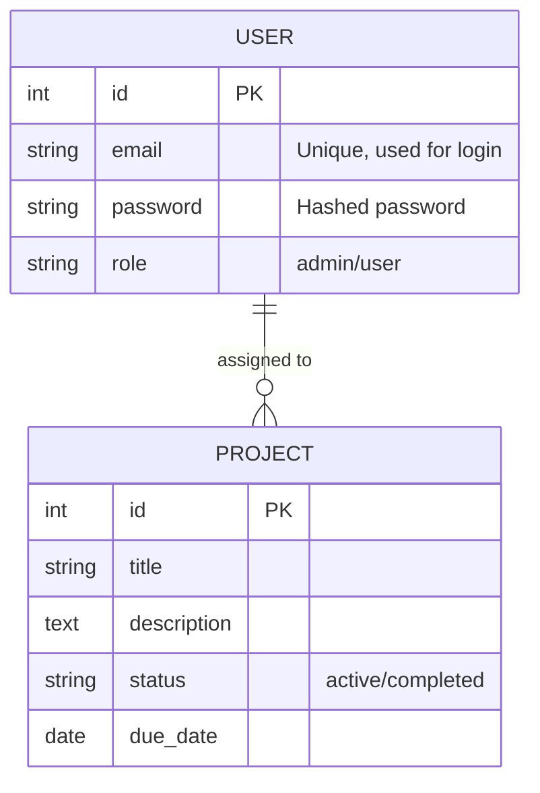

# ER Diagram for Project Management Dashboard

```mermaid
erDiagram
    USER {
        int id PK
        string email "Unique, used for login"
        string password "Hashed password"
        string role "admin/user"
    }

    PROJECT {
        int id PK
        string title
        text description
        string status "active/completed"
        date due_date
    }

    USER ||--o{ PROJECT : "assigned to"
```
